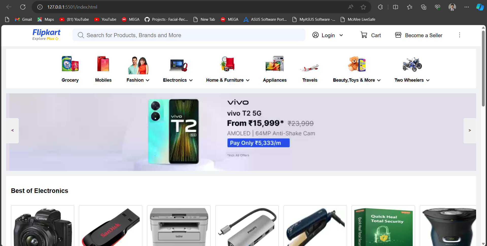
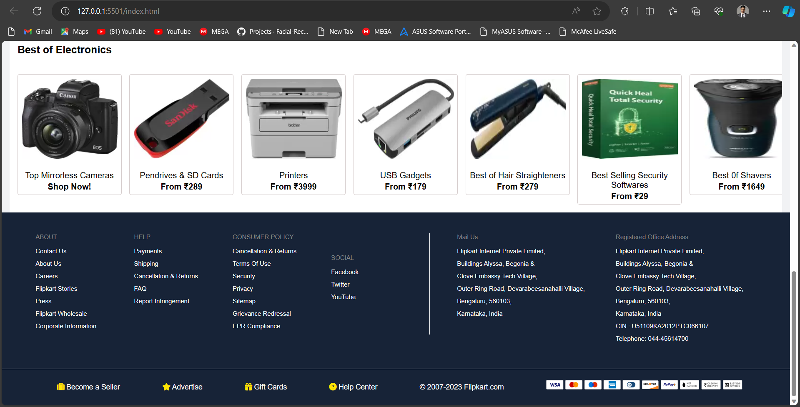
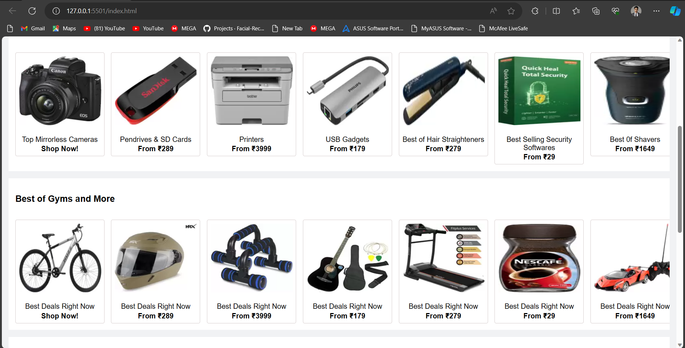

# Flipkart Clone - Frontend

## Overview
This repository contains the frontend implementation of a Flipkart clone, developed as a project to showcase HTML, CSS, and JavaScript skills. The project focuses on replicating the user interface of the popular e-commerce platform Flipkart.

## Features
- Responsive design for various screen sizes
- Home page showcasing product categories and featured items
- Product listing pages with dynamic content loading
- Product details page with additional information
- Interactive elements such as image sliders and hover effects
- Basic shopping cart functionality

## Technologies Used
- HTML5
- CSS3
- JavaScript

## Getting Started
To view the project locally, follow these steps:
1. Clone the repository: `git clone https://github.com/adityadwivedi2002/Flipkart-Clone`
2. Open the `index.html` file in your preferred web browser.

## Screenshots

## Contributing
If you'd like to contribute or have suggestions, feel free to create an issue or submit a pull request.

## License
This project is licensed under the MIT License - see the [LICENSE](LICENSE) file for details.

